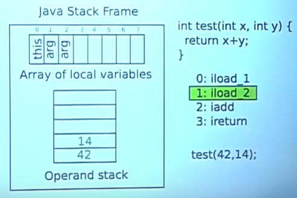
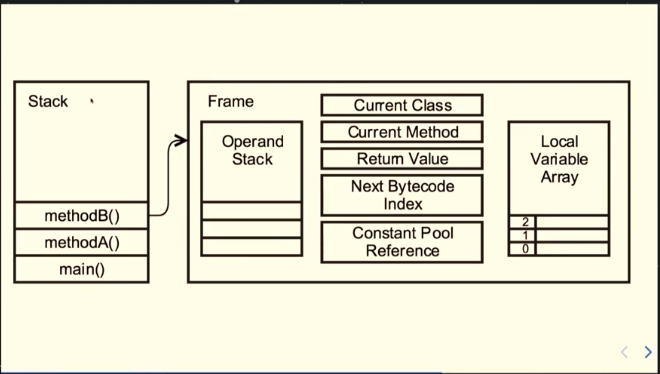

# java-stack

_Reference_: https://www.amazon.com/Java-Language-Features-Modules-Expressions/dp/1484233476  
_Reference_: [How the JVM compiles bytecode into machine code](https://www.youtube.com/watch?v=M8LiOANu3Nk)  

# stack
_Reference_: https://docs.oracle.com/javase/specs/jvms/se11/html/jvms-2.html#jvms-2.5.2

* each thread in a JVM has its own JVM stack
* created when thread is created
* LIFO
* stores frames
* holds local variables and partial results, and plays a part in method invocation and return
* stack is never manipulated directly except to push and pop frames, so frames may be heap allocated
* if the computation in a thread requires a larger Java Virtual Machine stack than is permitted, 
the Java Virtual Machine throws a `StackOverflowError`
* specification permits Java Virtual Machine stacks either to be of a fixed size or to dynamically expand
* if the Java Virtual Machine stacks are of a fixed size, the size of each Java Virtual Machine stack may 
be chosen independently when that stack is created
* default stack size (HotSpot): 320k in the 32-bit VM, 1024k in the 64-bit VM (https://www.oracle.com/technetwork/java/hotspotfaq-138619.html#threads_oom)
* set stack size: **-Xss**

# frame
* _Reference_: https://docs.oracle.com/javase/specs/jvms/se11/html/jvms-2.html#jvms-2.6  
* _Reference_: [2019 - Krzysztof Chruściel - Kilka wskazówek jak projektować użyteczne interfejsy](https://www.youtube.com/watch?v=-_dhEkdlsew)  
    * since 30:06
* frame size: 4 bytes
    * as a consequence: operation of adding two ints (2 x 4 bytes) pops 2 frames
    * and operation of adding two long (2 x 8 bytes) pops 4 frames
* is used to store data and partial results, as well as to perform dynamic linking, 
return values for methods, and dispatch exceptions
* new frame is created each time a method is invoked
* a frame is destroyed when its method invocation completes, whether that completion is normal or abrupt 
(it throws an uncaught exception)
* represents method invocation (in a given thread)
* it is an invocation context of a method
* for a given thread only one frame is active at any point
* active frame is called _current frame_ , corresponding method - _current method_, class declaring method - 
_current class_ 
* frames are allocated from the Java Virtual Machine stack of the thread creating the frame
* each frame has its own array of local variables, its own operand stack, and a reference 
to the run-time constant pool of the class of the current method

    
    
* the sizes of the local variable array and the operand stack are determined at compile-time and are 
supplied along with the code for the method associated with the frame
* frame ceases to be current if its method invokes another method or if its method completes
* lifecycle: 
    * when a method is invoked, a new frame is created and becomes current when control transfers to the new method
    * on method return, the current frame passes back the result of its method invocation, if any, to the previous frame
    * the current frame is then discarded as the previous frame becomes the current one
* frame created by a thread is local to that thread and cannot be referenced by any other thread
* JVM allows to hide some frames for performance reasons
    
## local variables
_Reference_: https://docs.oracle.com/javase/specs/jvms/se11/html/jvms-2.html#jvms-2.6.1

* each frame contains an array of variables known as its local variables
* length of the local variable array of a frame is determined at compile-time and supplied in the binary 
representation of a class or interface along with the code for the method associated with the frame
* single local variable can hold a value of type `boolean`, `byte`, `char`, `short`, `int`, `float`, 
`reference`, or `returnAddress`
* value of type `long` or type `double` occupies two consecutive local variables
* on class method invocation, any parameters are passed in consecutive local variables starting from local variable `0`
* on instance method invocation, local variable `0` is always used to pass a reference to the object on which the 
instance method is being invoked and other parameters are subsequently passed  in consecutive local variables 
starting from local variable `1`

## operand stack
_Reference_: https://docs.oracle.com/javase/specs/jvms/se11/html/jvms-2.html#jvms-2.6.2

* each frame contains a LIFO stack known as its operand stack
* example
    ```
    iload_0     # Push the value from local variable 0 onto the stack
    iload_1     # Push the value from local variable 1 onto the stack
    iadd        # Pops those off the stack, adds them, and pushes the result
    ```
    the `iadd` instruction adds two `int` values together - it requires that the `int` values to be 
    added be the top two values of the operand stack, pushed there by previous instructions. 
    1. both of the `int` values are popped from the operand stack. 
    1. they are added
    1. their sum is pushed back onto the operand stack
* maximum depth of the operand stack of a frame is determined at compile-time and is supplied along 
with the code for the method associated with the frame
* operand stack is empty when the frame that contains it is created
* Java Virtual Machine supplies instructions to load constants or values from local variables or 
fields onto the operand stack
* other Java Virtual Machine instructions take operands from the operand stack, operate on them, and push the 
result back onto the operand stack
* the operand stack is also used to prepare parameters to be passed to methods and to receive method results
* an operand stack has an associated depth, where a value of type `long` or `double` contributes two units to the depth 
and a value of any other type contributes one unit

## run-time constant pool
_Reference_: https://docs.oracle.com/javase/specs/jvms/se11/html/jvms-2.html#jvms-2.5.5

* run-time constant pool is a per-class or per-interface run-time representation of the `constant_pool` 
table in a class file
* example
    ```
    System.out.println("Hello, world!");
    ```
    produces bytecode
    ```
    0:   getstatic       #2; //Field java/lang/System.out:Ljava/io/PrintStream;              
    3:   ldc     #3; //String Hello, world!                                                  
    5:   invokevirtual   #4; //Method java/io/PrintStream.println:(Ljava/lang/String;)V
    ```
    `#2`, `#3`, `#4` - references to the constant pool (reference to field, reference to String, reference to method)
* contains several kinds of constants, ranging from numeric literals known at compile-time to method and 
field references that must be resolved at run-time
* each run-time constant pool is allocated from the Java Virtual Machine's method area
* the run-time constant pool for a class or interface is constructed when the class or interface is created
by the Java Virtual Machine

# projects
* https://github.com/mtumilowicz/java8-stack-stackwalking
* https://github.com/mtumilowicz/java9-stack-stackwalking
